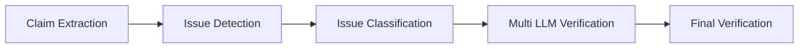

# Crosscheck Scoring Design

이 문서는 현재 analyzer의 검증 점수 계산 방식을 정리한다.

## Pipeline



## Stage Roles

| Stage | 역할 | 주요 출력 |
| --- | --- | --- |
| Claim Extraction | 원문 문맥에서 검증 가능한 raw claim span 추출 | `claim_id`, `claim_text`, `source_span_ids` |
| Issue Detection | claim과 배치 문맥을 보고 crosscheck 후보 선별 | `claim_id`, `candidate_confidence` |
| Issue Classification | 후보를 A-D 검증 유형으로 사전 분류 | `candidate_type_scores`, `candidate_primary_type_code`, `candidate_primary_type_reason` |
| Multi LLM Verification | 유형별 prompt로 넓은 문맥 검증 | 모델별 `issue_score`, `status`, `reason` |
| Final Verification | factual grounding, slide typo 등 후처리 | 최종 `status`, 공개 feedback payload |

## Stable Field Contract

`claim_text`는 extractor가 원문에서 뽑은 검증 대상 span이다.
후속 단계는 `claim_text`를 다시 쓰거나 보정하지 않는다.

`source_text`와 `claim_context_text`는 claim이 나온 원문 문맥을 가리킨다.
후속 단계에서 새로 요약한 문장은 별도 설명 필드에만 저장한다.

다음 필드는 production contract에서 제거했다.

- `resolved_claim`
- `verification_question`
- `problematic_content`
- `criteria_scores`
- `criteria_evidence`
- `score_breakdown`
- `verification_basis`
- `evidence_need`
- `claim_scope`
- `review_priority`

## Issue Types

Issue type은 네 개만 사용한다.
분류 단계는 네 점수를 독립적으로 산출하며, 합을 1로 맞추지 않는다.

| Code | Type | 표시명 | 핵심 기준 |
| --- | --- | --- | --- |
| B | `temporal_error` | 시간적 오류 | 현재성, 최신성, 지원 여부, 버전, 통계처럼 강의 제공 시점 또는 오늘 기준 확인이 필요한 경우 |
| C | `scope_overclaim` | 범위 과잉 단정 | 조건, 예외, 전체/일부, 가능/불가능, 일시/영구, 직접/간접의 범위가 닫혀 전달되는 경우 |
| A | `factual_error` | 발언 자체 오류 | 정의, 분류, 포함 관계, 수치, 순서, 주체, 과정, 인과, 작동 방식, 귀속 관계 자체가 틀린 경우 |
| D | `confusing_explanation` | 혼동 가능 설명 | 사실 오류로 바로 단정하기보다 생략/압축/흐름 때문에 학생이 구체적 오개념을 만들 가능성이 큰 경우 |

분류 우선순위는 `B -> C -> A -> D`다.
이는 특수성이 높은 현재성/범위 문제를 먼저 분리하고, 남은 후보에서 직접 사실 오류와 설명 혼동을 구분하기 위한 순서다.

## Type Classification

Issue `i`에 대해 classifier는 다음 벡터를 만든다.

```text
type_scores_i = [B_i, C_i, A_i, D_i]
```

각 값은 0~1 범위의 독립 confidence다.

대표 유형은 다음처럼 정한다.

```text
primary_type_i = argmax(type_scores_i)
```

동점이면 `B -> C -> A -> D` 순서를 따른다.

## Multi LLM Verification

Crosscheck는 후보의 대표 유형에 맞는 type-specific prompt만 사용한다.
후보가 두 유형 사이에 가깝게 걸린 경우에는 보조 유형 prompt를 추가로 실행할 수 있다.

각 모델 `m`은 issue `i`에 대해 다음을 출력한다.

```json
{
  "issue_id": "i0001",
  "status": "kept | rejected | merged",
  "issue_score": 0.0,
  "type_gate_passed": true,
  "reason": "문맥 기준 판단 이유",
  "context_resolution": "문맥에서 해소됨 | 일부 해소됨 | 해소 안 됨",
  "context_resolution_reason": "문맥 해소 여부 이유",
  "context_issue_summary": "문맥 안에서 실제로 남는 문제 흐름",
  "correction_hint": "필요할 때만 수정 방향"
}
```

`issue_score`는 모델이 해당 유형의 강의자 검토 대상으로 남길 가치가 얼마나 된다고 보는지 나타내는 최종 점수다.
이 값은 서버가 다시 criteria 가중합으로 계산하지 않는다.

점수 구간은 다음과 같다.

| Range | 의미 |
| --- | --- |
| 0.00-0.39 | 기각. 문맥상 해소되었거나 검토 가치가 낮음 |
| 0.40-0.79 | 강의자 확인. 실제 문제가 남을 수 있으나 자동 확정은 어려움 |
| 0.80-1.00 | 확정 후보. 원문 오류가 명확하고 문맥에서도 해소되지 않음 |

유형별 상한 원칙:

- A형은 명확한 원문 오류가 남으면 0.80 이상 가능
- B형은 시점/외부 기준 확인이 필요하므로 보통 0.40-0.79
- C형은 실제 배제/일반화/조건 차이가 남을 때 0.40 이상, 자동 확정처럼 0.80 이상은 제한
- D형은 구체적 오개념 문장이 남을 때 0.40 이상, 자동 확정처럼 0.80 이상은 제한

## Model Aggregation

모델 `m`의 가중치를 `w_m`, 모델 점수를 `s_m,i`라고 하면 최종 점수는 다음과 같다.

```text
final_score_i = sum_m(s_m,i * w_m) / sum_m(w_m)
```

현재 실험 기본 가중치 예시는 다음과 같다.

```text
gpt-5.4 = 0.4
claude-sonnet-4.5 = 0.4
grok-4.3 = 0.2
```

최종 상태는 `final_score_i`로 결정한다.

```text
confirmed       if final_score_i >= 0.80
professor_check if final_score_i >= 0.40
rejected        otherwise
```

## Merge

같은 문맥에서 같은 잘못된 명제를 가리키는 후보는 하나의 context-level issue로 병합한다.
단순히 같은 슬라이드에 있다는 이유만으로 병합하지 않는다.

병합 기준은 다음에 가깝다.

- 학생이 잘못 외울 명제가 같은가
- 같은 원문 문맥 흐름에서 발생했는가
- 같은 수정 방향으로 해결되는가

대표 issue는 가장 앞선 후보를 사용하고, 나머지는 모델별 결과에서 `status=merged`로 연결한다.
